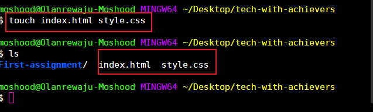
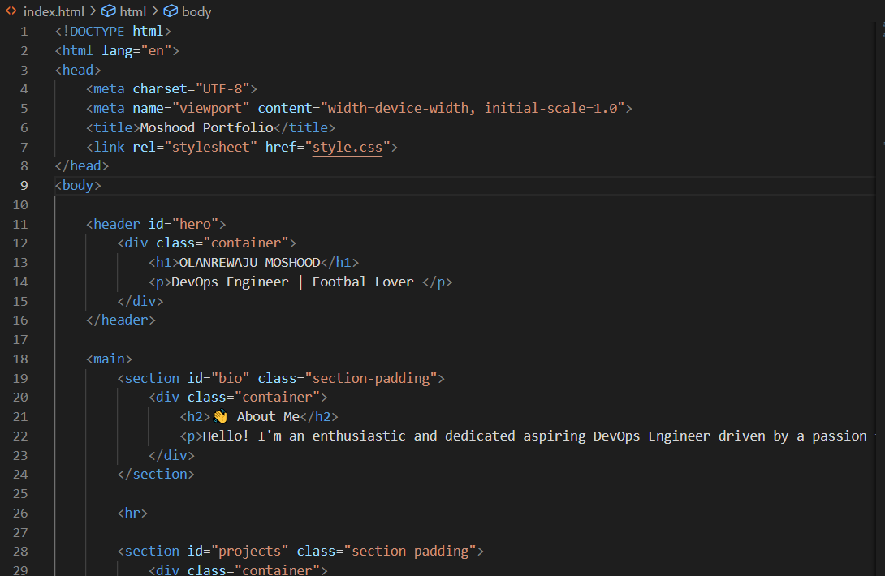
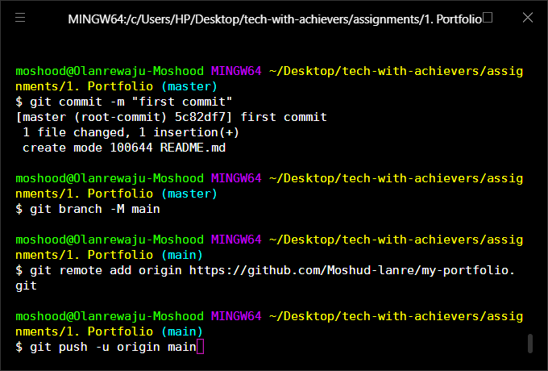

# my-portfolio

This document shows the steps taken in hosting my portfolio site on github

Step 1: Created two files (index.html & style.css) used to develop the portfolio site

Step 2: Populated the files with necessary codes to build the portfolio page

Step 3: Created and Pushed the code to a github repository.

Step 4: Hosted the portfolio page on github using the below steps

Go to Settings: In your repository, click on the Settings tab.

Navigate to Pages: In the left sidebar menu, find and click on Pages.

Configure the Deployment Source:

Under the Build and deployment section, look for the Source dropdown menu.

Select Deploy from a branch.

Select the Branch and Folder:

Under the Branch heading:

Select the main (or master) branch from the dropdown.

Select the root folder (/) from the second dropdown (since your files are in the main directory).

Click the Save button.

Wait for Deployment:

GitHub will now start the automated deployment process. This usually takes 1 to 5 minutes.
